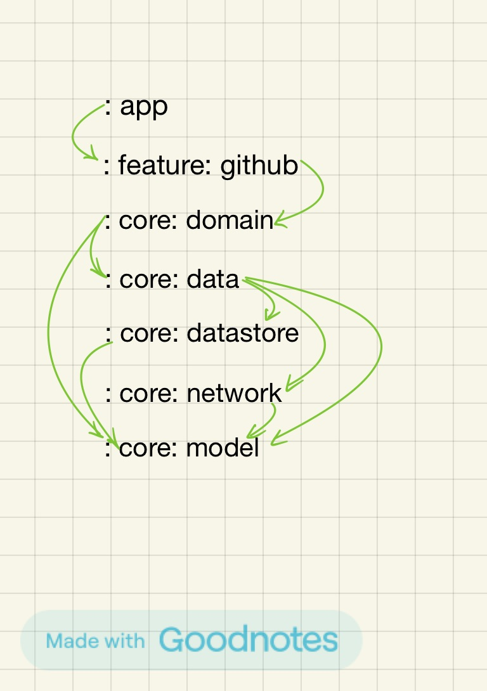

# SimpleList-forGithubApi

SimpleList is an Android application that displays a list of GitHub users and their event details using Jetpack Compose and various modern Android development practices. The project leverages Hilt for dependency injection, Retrofit for network operations, and Coil for image loading.

## Features

- List of GitHub users
- Detailed view of user information
- Display user events with detailed information
- Navigation using Jetpack Compose Navigation
- Modern UI with Jetpack Compose and Material3
- Dependency Injection with Hilt
- Asynchronous image loading with Coil
- ViewModel and State management with Compose

## Technologies Used

- **Kotlin**: Programming language used for the development
- **Jetpack Compose**: Modern toolkit for building native Android UI
- **Material3**: Material Design 3 for UI components
- **Hilt**: Dependency injection library
- **Retrofit**: Type-safe HTTP client for Android
- **Coil**: Image loading library for Android
- **Coroutines**: For asynchronous operations
- **ViewModel**: For managing UI-related data in a lifecycle-conscious way
- **Proto DataStore**: Used for storing and managing user preferences.
- **Version Catalog**: Utilized for managing and syncing dependency versions across modules.

## Setup and Installation

1. Clone the repository:
   ```sh
   git clone https://github.com/your-username/SimpleList.git
   ```
2. Open the project in Android Studio.
3. Make sure you have the latest version of Android Studio and SDK.
4. Add your GitHub personal access token to the `local.properties` file:
   ```
   GITHUB_TOKEN=your_personal_access_token
   ```
5. Sync the project with Gradle files.

## Usage

1. Run the app on an emulator or a physical device.
2. The app will display a list of GitHub users.
3. Click on a user to view detailed information.
4. Click on the "Received Events URL" to fetch and display the user's events.

## Project Structure
- `app`: The entry point of the application. It sets up the initial configuration and navigation graph.
- `core`: Contains core components, business logics such as models, data, and domain.
  - `domain`: Contains the use case and interfaces, directly called from VM.
  - `data`: Contains the data-related classes and interfaces, including repositories and data sources.
  - `datastore`: Manages user preferences and local storage using Proto DataStore.
  - `network`: Handles network operations and API definitions.
  - `model`: Contains the data models used throughout the app.
- `feature`: Contains feature-specific components, and Ui related components.


## Improvements and Future Work

- Add more detailed error handling and state management.
- Enhance the UI with more interactive elements and animations.
- Optimize image loading and caching.
- Improve documentation with comments and unit tests.

## Acknowledgments

- [Jetpack Compose](https://developer.android.com/jetpack/compose)
- [Hilt](https://dagger.dev/hilt/)
- [Retrofit](https://square.github.io/retrofit/)
- [Coil](https://coil-kt.github.io/coil/)
- [Version catalog](https://docs.gradle.org/current/userguide/platforms.html)

---

Happy coding!